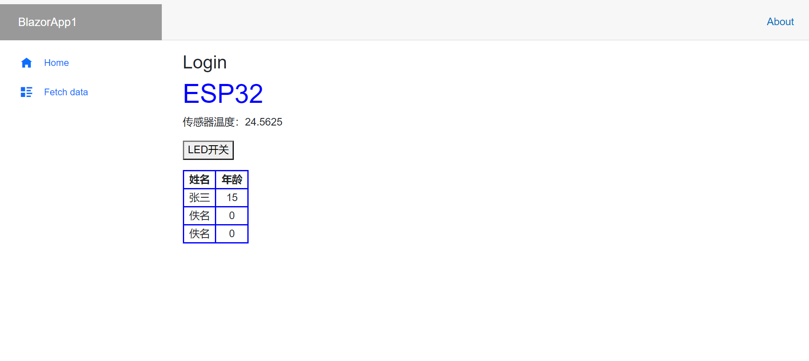
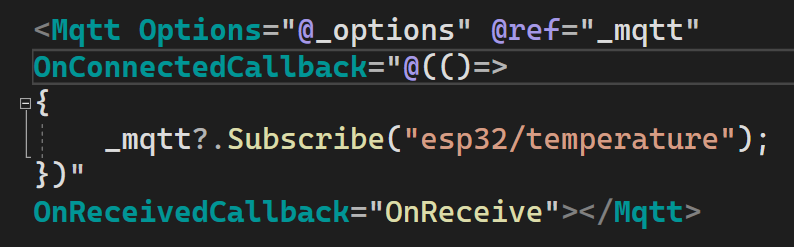
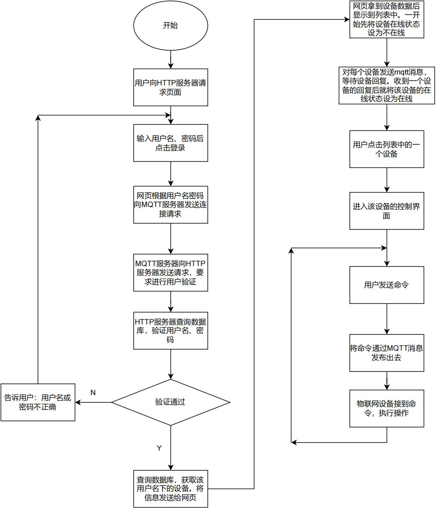
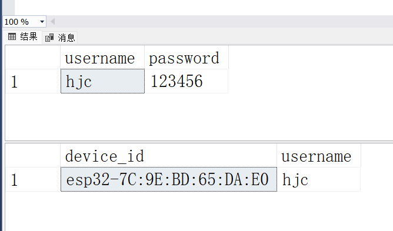
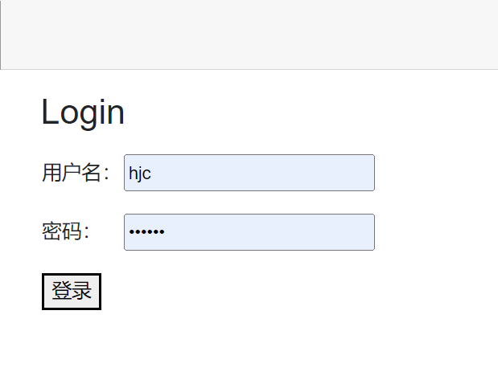
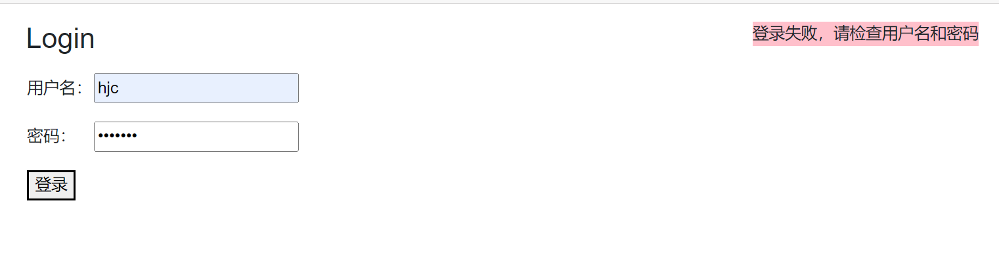
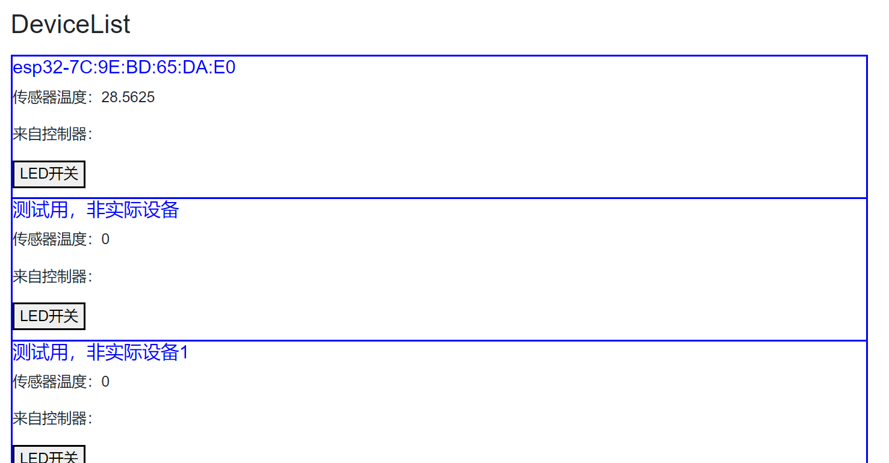
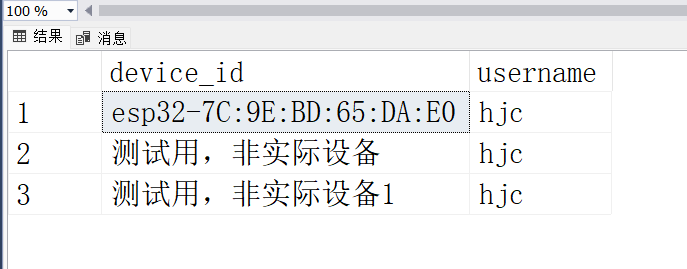

# 第5次工作记录

# 2022年4月25日- 2022年5月1日

# 学习内容和已完成设计（论文）内容

## 1. 学习使用Blaozr

因为js极其不擅长处理网络传输的字节流，且性能低下，webassemble 在这方面具有更高的性能。同时，js的动态类型和宽松的语法导致代码难以维护，编写程序时代码提示不够友好，大大降低了效率。微软推出的 Blazor 框架基于 webassemble ，在浏览器环境中构建出 .NET 运行环境，使得能够使用C#编写网页。但是，webassemble的生态比js差，所以Blazor提供了与js互操作的功能。

本周使用Blazor制作出了网页，并对数据绑定、路由等功能进行了探索。制作出的网页如图1.1所示



<center>图1：本周制作的网页</center>


## 2. 编写了用于MQTT连接的Blazor组件



该组件通过传入参数就可以轻松使用。该组件是通过razor语法对js的开源库mqtt.js进行的包装。同时实现该组件的独立性，降低耦合性，该组件通过被创建后往head标签添加script标签的方式导入mqtt.js，无需用户手动添加script标签。可以从CDN获取脚本，也可以手动将脚本放在本地的wwwroot文件夹中，使用 /js/mqtt.min.js 进行引用。

```javascript
/**
 * 从CDN获取mqtt.js并加载，加载完成后触发事件，调用 .NET 方法
 * @param {any} dotnetHelper
 */
export function installMqtt(dotnetHelper) {
    if (window.mqttInstalled === true) {
        dotnetHelper.invokeMethodAsync("OnInstalled");
    } else {
        let script = document.createElement('script');
        //script.src = "https://unpkg.com/mqtt/dist/mqtt.min.js";
        script.src = "/js/mqtt.min.js";
        script.async = true;
        script.onload = () => {
            dotnetHelper.invokeMethodAsync("OnInstalled");
        }
        document.head.append(script);
        window.mqttInstalled = true;
    }
}

```

## 3. 降低查找主题相应的处理函数的时间复杂度

MQTT消息采用主题加载荷的结构。主题是字符串的形式。当接收到一个消息后需要判断主题是什么，然后进入相应的处理函数。

ESP32的程序使用C++编写，C++的switch语句不支持字符串，但是map可以使用对象作为键或值。使用map就可以将查找的时间复杂度降低。避免使用大量的if-else语句对主题进行判断。

```c++
/**
 * @brief 收到订阅的主题的数据后被回调
 *
 * @param topic 主题。C风格的字符串
 *
 * @param payload 一个uint8_t数组的首地址。注意，如果内容是字符串，它的
 * 末尾并没有被添加空字符，需要手动添加
 *
 * @param length payload的长度
 */
void TestMQTTClient::OnReceive(char *topic, uint8_t *payload, unsigned int length)
{
    String topicStr = String(topic);
    StringSplitter subTopics(topicStr, '/', 10);
    int count = subTopics.getItemCount();
    if (count >= 3)
    {
        //至少要3级子主题
        int index = 0;
        if (subTopics.getItemAtIndex(index++) == "esp32")
        {
            if (subTopics.getItemAtIndex(index++) == "command")
            {
                auto it = m_commandMap.find(subTopics.getItemAtIndex(index++));
                if (it != m_commandMap.end())
                {
                    (it->second)(payload, length);
                }
            }
        }
    }
}

void TestMQTTClient::InitCommandMap(void)
{
    m_commandMap["msp"] = [](uint8_t *payload, uint32_t length) -> void
    {
        pTar->sendData(payload, length);
    };
}
```

在上面的代码中，一级和二级子主题因为数量较少，采用二级嵌套if-else语句进行解析，三级子主题量较大，使用if-else语句非常不合理，时间复杂度为O(n)，所以采用map，将时间复杂度降低为O(logn)

在构造函数中调用 InitCommandMap 函数往map中添加主题及对应的处理函数。其中，m_commandMap的类型为

```c++
    std::map<String, std::function<void(uint8_t *payload, unsigned int length)>> m_commandMap;
```

因为主题并不会在工作时插入，只会在初始化的时候插入，所以不会因为map内部对节点频繁进行排序而降低性能。

## 4. 绘制用户端业务的流程图




# 本次工作中的收获

1. 学习了Blazor
2. 完成了通信功能的程序框架
3. 绘制了下一步工作的流程图
4. 降低了了主题查找的时间复杂度

# 与上周工作和原定进度安排相比，未完成的工作和原因

上周工作顺利完成

# 设计困难和解决方案，下周工作进度安排

1. 完成流程图中的程序
2. 完成论文到二级标题的初步构思

# 2022年5月2日- 2022年5月8日

# 学习内容和已完成设计（论文）内容

## 1. 配置数据库

如下图所示，数据库中有两张表，一张用户表，一张设备表。用户表中有两个字段，一个字段是username，另一个字段是password。设备表有两个字段，一个字段是device_id，另一个字段是username，表示该设备属于哪个用户。



## 2. 用户登录认证

用户登陆界面如图所示



用户输入用户名密码后点击登录，网页将数据发送给 HTTP 服务器，服务器检查数据库，认证成功则返回 200 状态码，失败则返回其他状态码。

如果登录失败，网页会有如下图的弹窗提示



如果登录成功，页面将会跳转到设备列表。



该列表列出了用户的数据库中的设备



并且列表中的每一项都维护着与该设备的通信，能够与设备进行交互。

## 3. MQTT 连接认证

MQTT 客户端想要与 MQTT 服务器建立连接也需要认证。在配置文件中设置认证方式为 HTTP 认证。当 MQTT 客户端企图建立连接时，MQTT 服务器会发送 HTTP 的 POST 请求给 HTTP 服务器，请求体中附带了 MQTT 客户端的信息，例如用户名密码等。HTTP 服务器查询数据库确定是否认证通过。认证通过返回 200 状态码，否则返回其他状态码。

## 4. 主题的规划

下文中出现的像 [xxxx] 这种形式的，方括号里面包含着一些文字的，这里约定为：把方括号和里面的文字整体替换为方括号内的文字描述的内容。

### 客户端 ID 格式

每个 MQTT 客户端都有一个客户端 ID，是字符串的形式。在同一个 MQTT 服务器中，客户端 ID 不能一样。

ESP32 的客户端 ID 格式为：

```
esp32-[MAC地址]
```

网页的客户端 ID 为：

```
mqttjs_[随机数转化为16进制字符串]
```

### 自定义的接收发送概念

#### 主场接收

主场接收是指在自己的客户端 ID 的子主题下接收消息。

如果每个 MQTT 客户端都订阅这么一个主题

```
[自己的客户端ID]/#
```

\# 为通配符，代表任意数量的任意子主题。那么其他客户端想要发送消息给某个 MQTT 客户端时只需要将第一个子主题设置为接收方的客户端 ID 就行了。

通过这种方式，接收方并不知道会不会接收到数据，也不知道谁会给它发送数据。

#### 客场接收

客场接收是指在他方的客户端 ID 的子主题下接收消息。

以接收 esp32 发布的温度数据为例。网页端主动订阅主题：

```
esp-[MAC地址]/temperature
```

这样，esp32 向该主题发布消息的时候，订阅者就会收到消息。

#### 主场发布

主场发布是指在自己的客户端 ID 的子主题下发布消息。

主场发布不针对特定的客户端，发送方并不知道有多少个接收方。例如 esp32-7C:9E:BD:65:DA:E0 发布了下面的主题

```
esp32-7C:9E:BD:65:DA:E0/temperature
```

第一个子主题是它自己的客户端 ID 。

主场发布对应客场接收

#### 客场发布

客场发布是指在他方的客户端 ID 的子主题下发布消息。

例如网页想要控制 esp32-7C:9E:BD:65:DA:E0 的 LED 灯，于是对着

```
esp32-7C:9E:BD:65:DA:E0/command/LED
```

发布了一条消息，esp32-7C:9E:BD:65:DA:E0 是他方的客户端 ID，所以叫客场发布。

客场发布对应主场接收。

### 原则

控制器是性能较低的设备，而运行网页的上位机性能较高。所以，控制器采用主场发布和主场接收，网页采用客场发布和客场接收。

# 本次工作中的收获

1. 通过调试和思考，得出了：主场发布、主场接收、客场发布、客场接收等概念，使 MQTT 通信的流程和方式清晰。
2. 完成了用户登录认证和设备登录认证
3. 网页的 UI 呈现方式基本确定

# 与上周工作和原定进度安排相比，未完成的工作和原因

上周工作顺利完成

# 设计困难和解决方案，下周工作进度安排

网页 UI 界面十分简陋，继续完善 UI 界面。

