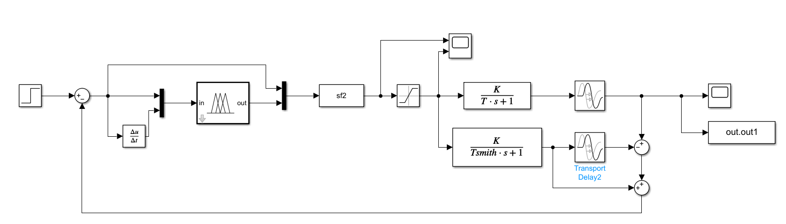
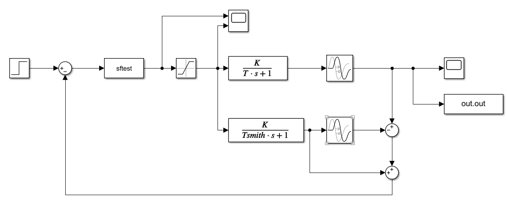
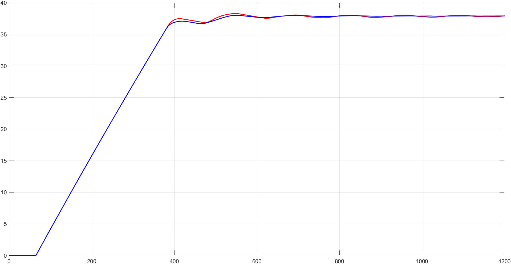
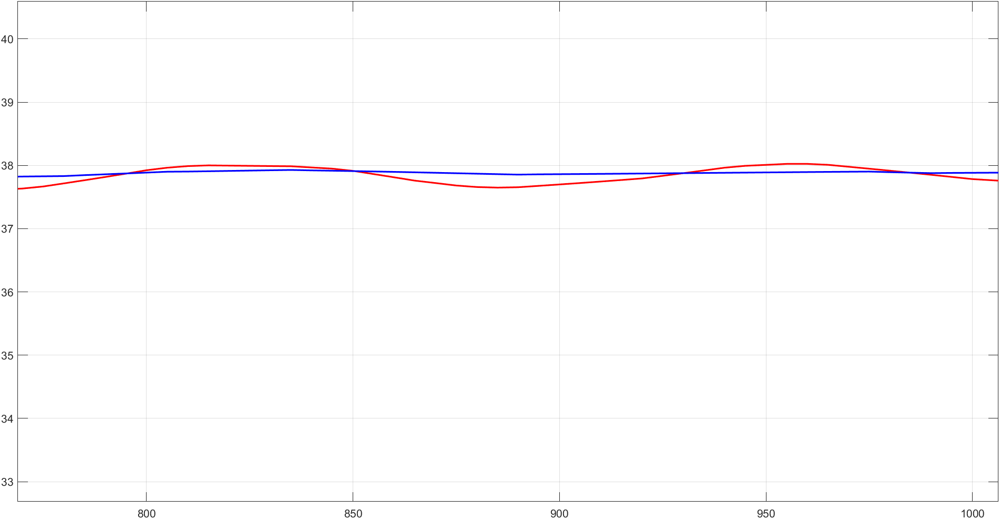
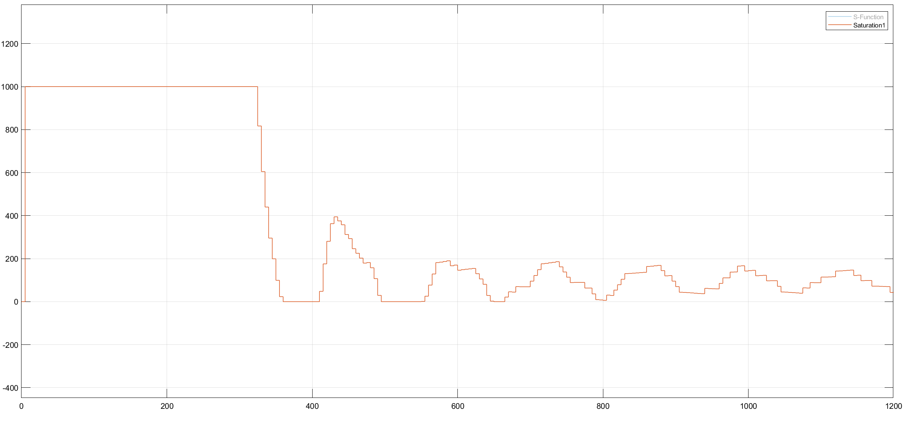
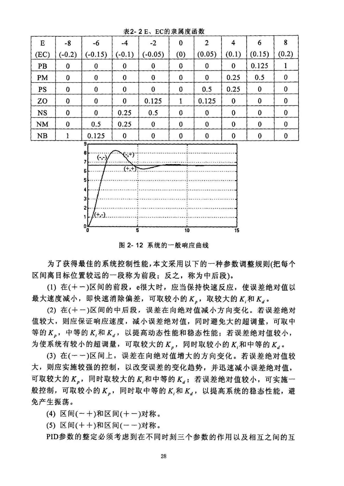
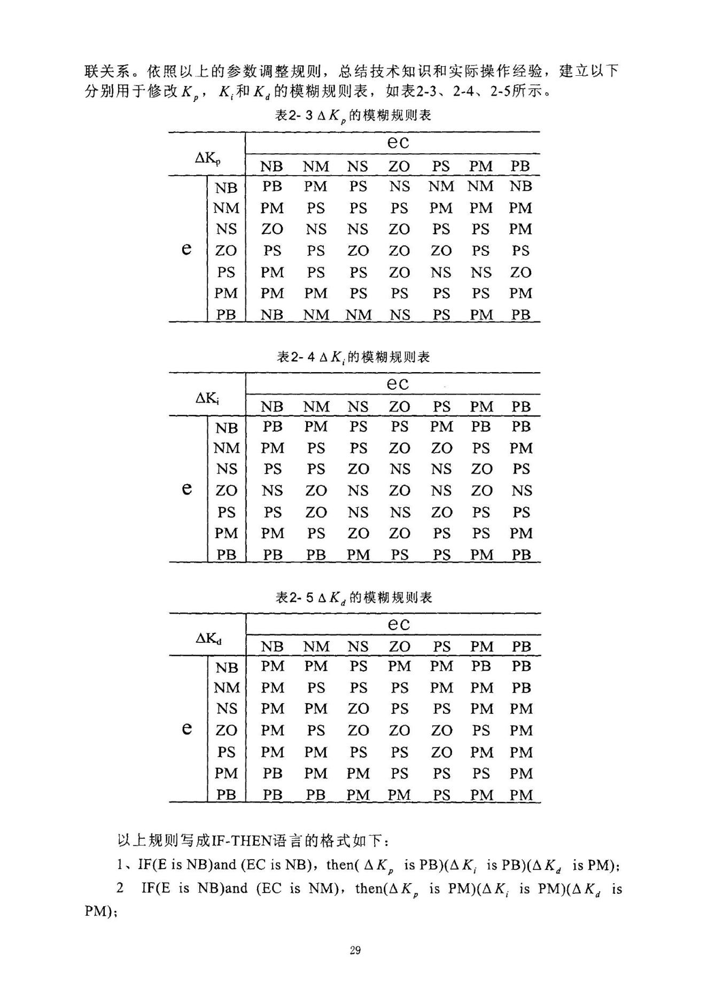

# 2022年3月14日- 2022年03月20日
## 学习内容和已完成设计（论文）内容
### 学习了C# 的异步编程
C# 的异步编程是靠Task类和await, async 关键字实现的，底层的原理是线程池。官方文档中称为公共语言运行时线程池（CLR 线程池）。如果一个方法是异步的，被调用后运行到异步方法内部的含有await关键字的语句出会返回到调用方，被await的任务将添加到线程池中运行。Task 类和await, async 关键字对线程池进行了包装，使程序员能够用与编写同步运行的代码相同的结构编写出异步运行的代码。
对于像响应http 请求这种任务，要花费一定时间，不能阻塞，必须采用并发。并发最基础的方法就是创建新线程。但是，如果大量的http 请求在短时间内同时到来，如果对每个请求都创建一个线程去响应，响应结束后线程销毁，则在创建和销毁线程的过程累加起来会占用大量时间，且线程过多会造成每个任务被调度的时间间隔很长，结果并不能提高并发程度。使用线程池可以省去创建和销毁线程花费的时间，同时防止过调度，提高了执行效率，防止系统关键线程长时间得不到执行。计算密集型和IO密集型任务非常适合使用线程池。
C# 使用await关键字对运行于线程池上的任务进行等待。等待可以不在主线程，可以创建一个后台线程专门用于等待，任务的返回值会被保存在Task类中，可以创建一个任务链表，每运行一个任务就将Task对象添加到链表，在另一个线程中使用Task.WhenAny() 或Task.WhenAll() 方法在链表中的任务运行结束时获取到结果，然后将其从链表中删除。
对于http请求，不需要使用await进行等待，使用异步方法来处理响应，直接调用异步方法，让其进入线程池执行，执行完成后将数据发送给客户端。

### 使用异步编程处理web请求
使用 MyWebServer 类创建一个 web 服务对象。在构造函数中创建新线程用来监听。
```csharp
        /// <summary>
        /// 构造函数
        /// </summary>
        /// <param name="rootPath">根路径</param>
        /// <param name="listenUrl">要监听的URL，类似于：@"http://192.168.31.186:80/"</param>
        public MyWebServer(string rootPath, string listenUrl)
        {
            if (!listenUrl.EndsWith(@"/"))
            {
                listenUrl += "/";
            }
            _httpListenr = new HttpListener();
            _httpListenr.Prefixes.Add(listenUrl);
            _httpListenr.Start();
            RootPath = rootPath;
            //创建一个新线程，用来获取Context
            new Thread(new ThreadStart(GetContextThread)).Start();
        }
```
在新线程中在死循环中不断获取请求，然后以异步方式处理请求。
```csharp
        void GetContextThread()
        {
            while (true)
            {
                HttpListenerContext context = _httpListenr.GetContext();
                HandleContextAsync(RootPath, context);//以异步方式处理请求
            }
        }

```
HandleContextAsync 是一个异步的方法，原型如下
```csharp
static async void HandleContextAsync(string rootPath, HttpListenerContext context)
```
调用异步方法，在执行到内部的带有 await 的语句时就会返回，剩下的部分被添加到线程池中执行，调用方不用处理废时间的任务，这样将很快返回到 GetContextThread 继续监听下一个 http 请求。
GetContextThread 将根据请求头信息判断是 http 请求还是一个要求升级到 WebSocket 的请求。如果是 WebSocket 请求，将创建一个 WebSocketHandler 对象用来和 web 保持连接，并监听 web 发送过来的信息。
### 使用异步编程处理 TCP 连接请求
与处理 http 请求的方式类似，处理 TCP 请求也是用了 C# 的异步编程。通过实例化 MyTcpServer 对象来创建一个 TCP 服务。在构造函数中创建新线程，新线程在死循环中监听请求。收到请求后创建一个 TcpClientHandler 对象用来处理请求。TcpClientHandler 对象在新线程中用死循环监听客户端发来的数据。
### 处理 TCP 数据的消息边界问题
TCP 会对小的数据进行粘包，对大的数据进行拆包，且没有提供指示每个包的边界的方法，所以需要一种方法来从 TCP 的数据队列中还原出一个一个的包。
通过让每个包头部的两个字节带上内容长度的信息来让接收方获取数据包长度，从而区分出一个一个的包。对于大的包，被拆分到两个 TCP 帧中，需要等待下一个 TCP 帧到来，收到完整的一个包后再提交给应用层。
```csharp
        /// <summary>
        /// 接收客户端数据的线程
        /// </summary>
        void ReceiveDataThread()
        {
            try
            {
                int offset = 0;//偏移量，等于当前帧中已读取的数据个数，下次存放数据时，从当前位置开始存放
                byte[] lenBuff = new byte[2];//用来储存每个帧开头的两个字节，表示数据域长度
                int dataLength = 0;//要接收的数据长度
                byte[] tcpReceiveData = null;//接收缓冲区

                while (true)//在死循环中不断监听客户端发过来的数据
                {
                    if(_networkStream.DataAvailable)//如果有数据
                    {
                        if(offset == 0)
                        {
                            //接收全新的一个帧
                            _networkStream.Read(lenBuff, 0, 2);//获取数据域长度
                            dataLength = BitConverter.ToUInt16(lenBuff, 0);
                            tcpReceiveData = new byte[dataLength];//创建接收缓冲区
                            offset = _networkStream.Read(tcpReceiveData, 0, dataLength);
                            if(offset == dataLength)
                            {
                                //接收完成
                                offset = 0;
                                //以异步方式执行任务
                                TcpJob.DoJob(this, tcpReceiveData);
                            }
                        }
                        else
                        {
                            offset += _networkStream.Read(tcpReceiveData, offset, dataLength - offset);
                            if (dataLength==offset)
                            {
                                //数据接收完成
                                offset = 0;//重置偏移量
                                //以异步方式执行任务
                                TcpJob.DoJob(this, tcpReceiveData);
                            }
                        }
                    }
                }
            }
            catch
            {
                Dispose();
            }
        }

```
TcpJob 是应用层，负责接收数据包，执行相关的任务。执行任务也是通过异步的方式，从而让 ReceiveDataThread 能够尽快解脱去接收下一个数据包。物联网设备本身内存小，flash 也小，所以不会出现一个大的包使服务器内存占满的情况。
### 多个 WebSocketHandler 对象和多个 TcpClientHandler 对象之间的通信
WebSocketHandler 对象负责和 web 通过 WebSocket 进行通信。TcpClientHandler 对象负责和物联网设备用 TCP 进行通信。

1. **web 发给指定设备的命令如何传递给与该设备连接的 TcpClientHandler 对象？**

使用 C# 的字典（和C++的map一样）来实现。如下方的代码所示 TcpClientHandler 每实例化一个对象后就将自己添加到 _handlerDir 中，Key=设备的ID，Value=TcpClientHandler对象自己。C# 的字典使用的是哈希表，查找速度很快。
```csharp
/// <summary>
/// 用来储存这个类的对象，键是UInt64类型的，储存着是设备ID，对应着与该
/// 设备连接的TcpClientHandler
/// </summary>
static public Dictionary<UInt64, TcpClientHandler> _handlerDir=new Dictionary<UInt64, TcpClientHandler>();

```
这样，WebSocketHandler 对象想要将数据发送给指定的设备，只要查找 _handlerDir ，通过设备 ID 找到与它连接的 TcpClientHandler 对象，调用该对象的方法将数据发送给指定设备。

2. **WebSocketHandler 实例化后如何接收指定设备的数据？**

在 TcpClientHandler 对象中有一个委托，如下所示
```csharp
/*websocket订阅该委托，以与该客户端建立联系
web端会选择一个设备进行查看和管理，每一个web客户端选择的设备可能都不同，
物联网设备发送信息时，如果有web端选择了它，则将信息发送给该web，web不应该接收
没被选中的设备的信息*/
public delegate void SendDataToWebFun(string str);
public SendDataToWebFun SendDataToWeb;

```
一个 WebSocketHandler 对象实例化后想要接收某个或某些设备的数据，只要通过字典查询到与这些设备连接的 TcpClientHandler 对象，将自己的 SendDataToWebSocket 方法添加到委托中。这样，当这些设备有数据要发送过来时，就会调用委托，使 WebSocketHandler 获取到数据。
### 委托的并发
C# 的委托也可以并发。如果加入到委托中的方法是异步的，在调用委托的时候，委托链中的方法会被一个一个地调用，遇到 await 后将任务添加到线程池并返回，继续调用委托链中的下一个方法。这样，委托链中的方法实现了并发。
### 数据库
学习了 SQL Server 的增删改查命令，使用 C# 连接到 SQL Server 进行了测试，例如：在控制台输出数据库的记录，通过 C# 添加一条记录，通过 C# 修改一条记录的一个字段。
## 本次工作中的收获

1. 定义了数据交换格式和方式，为以后实现应用功能奠定了基础
1. 掌握了 C# 更先进的编程技巧，提高代码运行效率和整洁程度
1. 对 SQL Server 有了初步的认识
## 与上周工作和原定进度安排相比，未完成的工作和原因
上周工作顺利完成
## 设计困难和解决方案，下周工作进度安排

1. 使用循环队列实现串口数据的管理
1. 用 C++ 模拟出 C# 的委托，应用到 MSP430 和 ESP 中
1. 在 MSP430 中通过回调的方式实现软件定时器和在死循环中不断执行的任务。想要执行的任务添加到列表中，被回调时执行。
1. 完成对水箱温度模型的机理建模，并完成使用传统 PID 控制的仿真。

# 2022年3月21日- 2022年03月27日
## 学习内容和已完成设计（论文）内容
### 通过回调的方式来执行任务
通过下面要讲的这些类来执行任务有个好处，就是可以实现以后的类的自治。比如一个类需要有一个方法在 main 函数的死循环中被调用，可以在这个类的构造函数中将这个类的该方法添加到 Task 的任务列表中。这样，想要实现一个功能的时候只要实例化一个对象就行了，不用再把类中的各个方法或标志位放到各种地方进行环境配置。

1. **软件定时器**

软件定时器类 Timer 有一个 `bool `变量 `m_bTimeUp `，这个变量在硬件定时器中断中设置为真，Timer 的 handle 方法放在 main 函数的死循环中。handle 方法检测到 `m_bTimeUp `为真就将它设置为假，并从任务列表中取出任务，判断任务的定时是否到了，到了就执行。Timer 从 `TimerBase `那里继承了一个 Task 结构体和一个     `list<Task> taskList; `
```cpp
    struct Task
    {
        uint16_t id;
        uint16_t interval = 0; //任务的时间间隔
        uint16_t count = 0;    //递减，初值等于interval，为0时就执行fun
        function<void(void)> fun;
    };
    list<Task> taskList; //任务列表

```
Task 储存着被添加到软件定时器的任务，   ` list<Task> taskList` 是任务的列表。`handle `方法在每次执行时都递减 `Task.count` ，递减到等于 0 时回调 fun ，然后将 `count `恢复为 `interval `的值。
`addTask` 方法也是继承自 `TimerBase `，实现如下

```cpp
    uint16_t addTask(uint16_t interval, function<void(void)> fun)
    {
        m_id++;
        Task task =
            {
                .id = m_id,
                .interval = interval,
                .count = interval,
                .fun = fun,
            };
        taskList.push_back(task);
        return m_id;
    }
```
想要添加一个任务，调用 addTask 方法，传入时间间隔和回调函数。
handle 方法的实现如下
```cpp
    void handle(void)       //放到死循环中
    {
        if (m_bTimeUp)
        {
            m_bTimeUp = false;
            /*在这里取出任务列表中的任务执行*/
            m_itNow = taskList.begin();
            while (m_itNow != taskList.end())
            {
                if ((*m_itNow).count)
                {
                    //时间还没到
                    (*m_itNow).count--;
                    m_itNow++;
                }
                else
                {
                    //时间到了
                    (*m_itNow).fun(); //如果fun把迭代器指向的项删除了，it就会变成野指针
                    if (m_itNow == taskList.end())
                    {
                        //迭代器失效了
                        m_itNow = m_itNext;
                    }
                    else
                    {
                        //迭代器没有失效
                        (*m_itNow).count = (*m_itNow).interval;
                        m_itNow++;
                    }
                }
            }
        }
    }
```
Timer 还支持删除已经添加到列表中的定时任务。通过一个 `uint16_t m_id` 变量作为被添加的任务的 ID ，类操作系统的句柄，想要删除任务就通过 ID 进行删除。
**避免迭代器失效**
删除一个任务的时候有可能是正在被回调的任务删除自身，也就是说在循环内删除当前迭代器正在访问的结点，这会导致迭代器失效，访问一个失效的迭代器会造成死机。所以，为了避免迭代器失效要进行一些处理。
类的字段     `list<Task>::iterator m_itNow;` 指示了 `handle` 方法当前正在处理的任务，delete 方法发现要被删除的任务的迭代器与 `list<Task>::iterator m_itNow` 相等时就要特殊处理。

```cpp
    void deleteTask(uint16_t id)
    {
        for (auto it = taskList.begin(); it != taskList.end(); it++)
        {
            if ((*it).id == id)
            {
                m_itNext = taskList.erase(it); //找到了就把它删除
                if (it == m_itNow)             //如果删除的是handle中正在使用的迭代器
                {
                    m_itNow = taskList.end(); //迭代器失效后把它赋值为end
                }
                break;
            }
        }
    }

```
首先将 `list<Task>::iterator m_itNext` 赋值为 `taskList.erase(it)` 的返回值，即获取下一个迭代器，然后将 `m_itNow` 赋值为 `taskList.end()` ，这样 `handle` 方法就能发现迭代器已失效，从 `m_itNext` 取得下一个迭代器，而不是对 `m_itNow` 进行递增。

2. **Ticker 类**

这个类和定时器类类似，不过它的任务是执行一次后就被删除，相当于延时触发任务。`Ticker `类和 `Timer `类都继承自 `TimerBase`。`TimerBase `, `Timer`, `Ticker `类的完整代码见附录。

3. **Task 类**

这个类用来在 main 函数的死循环中回调任务列表中的任务，同样的，也支持删除任务列表中的任务，并且对防止迭代器失效进行了处理。

### 模拟 C# 的委托
通过一个 Delegate 类来模拟 C# 的委托。委托订阅方调用该类的 addTask 方法添加一个任务，委托执行方调用该类的 handle 方法。调用 handle 方法时可以传入一个 void* 类型的变量。该类的实现如下
```cpp
class Delegate
{
public:
    uint16_t add(function<void(void *pParam)> fun)
    {
        m_id++;
        TaskStruct task =
            {
                .id = m_id,
                .fun = fun,
            };
        taskList.push_back(task);
        return m_id;
    }
    void deleteTask(uint16_t id)
    {
        for (auto it = taskList.begin(); it != taskList.end(); it++)
        {
            if ((*it).id == id)
            {
                m_itNext = taskList.erase(it); //找到了就把它删除
                if (it == m_itNow)             //如果删除的是handle中正在使用的迭代器
                {
                    m_itNow = taskList.end(); //迭代器失效后把它赋值为end
                }
                break;
            }
        }
    }
    void handle(void *pParam)
    {
        m_itNow = taskList.begin();
        while (m_itNow != taskList.end())
        {
            (*m_itNow).fun(pParam);
            if (m_itNow == taskList.end())
            {
                //迭代器失效了
                m_itNow = m_itNext;
            }
            else
            {
                //迭代器没有失效
                m_itNow++;
            }
        }
    }

protected:
    uint16_t m_id = 0;
    struct TaskStruct
    {
        uint16_t id;
        function<void(void *pParam)> fun;
    };
    list<TaskStruct>::iterator m_itNext;
    list<TaskStruct>::iterator m_itNow;
    list<TaskStruct> taskList; //任务列表
};
```
### 编写循环队列类
循环队列类实现见附录。
构造函数有两个重载，分别如下
```cpp
CircularQueue(void)
{
    m_queue = new T[m_maxSizeofQueue];
}

CircularQueue(uint8_t maxQueueSize)
{
    m_queue = new T[maxQueueSize];
    m_maxSizeofQueue = maxQueueSize;
}

```
`m_maxSizeofQueue `是类的字段，初始值为 50，如果选择 `CircularQueue(void)` 构造函数，则最大队列长度为50，选择 `CircularQueue(uint8_t maxQueueSize) `可以自定义队列长度。
循环队列类内部定义了一个友元类 `QueueIndex `用来索引队列中的元素。循环队列的索引在到达边界后需要跳到另一端，通过 `QueueIndex `重载 ++ 运算符来实现这一功能。同时，`QueueIndex `重载了 * 运算符，使之具有像 STL 迭代器那样的取得指向的元素的引用的功能。在 `CircularQueue `初始化的时候初始化 `QueueIndex `，将 `this `指针传递进去，使 `QueueIndex `获得 `CircularQueue `的实例。
`CircularQueue `重载了 [] 运算符，使之具有像数组那样的随机索引功能。

### 使用循环队列类管理串口数据
Arduino 框架下提供串口类 `Serial `，方便用户使用串口。这个类对用户隐藏了硬件的细节，用户只需要调用它的方法，检查是否有数据，有的话调用它的方法读取。写数据也非常方便，调用 `Serial.print()` 方法或 `Serial.write()` 方法就行了。而 MSP430 没有提供这种类库，需要自己实现。为了使以后的编程更方便，缩小 MSP430 和 ESP 之间的差异，我在 MSP430 上实现了 `Serial ` 类，这样，关于串口部分的代码就可以统一编写了，不用分别对 MSP430 和 ESP 分别编写。
Serial 类的定义如下

```cpp
#ifndef SERIAL_H
#define SERIAL_H

#include <stdint.h>
#include <list>
#include "driverlib.h"
#include "CircularQueue.h"
#include "Timer.h"

using namespace std;

class HardwareSerial
{
private:
    CircularQueue<uint8_t> m_readBuff, m_txBuff; //使用循环队列实现的接收、发送缓冲区

public: //环境配置
    HardwareSerial(void);
    void readDataInRxISR(void); //放在接收中断服务程序
    void sendDataInTxISR(void); //放到发送中断服务程序

private: //重新启动发送
    /* 串口的发送中断是上升沿触发，硬件的发送缓冲寄存器 TXBUFF 为空后会触发中断，
    进入中断后如果没有往 TXBUFF 写数据，退出中断后，便无法再次进入中断，除非
    再次向 TXBUFF 写入数据 */
    bool m_btxDone = true; //这个标志位为真表示发生过进入中断但没有往TXBUFF写数据
    void startSend(void);

public:                              //提供给用户的方法
    void begin(void);                //初始化UART模块
    void write(uint8_t data);        //向发送队列中写一个数据
    uint8_t read(void);              //从接收队列中读取一个数，读取后数据会从队列中删除
    uint8_t availableForWrite(void); //发送队列剩余空间
    uint8_t available(void);         //接收队列长度
    void flush(void);                //等待直到发送缓冲区清空
};
extern HardwareSerial Serial;

#endif // SERIAL_H

```
该类中有两个方法
```cpp
void readDataInRxISR(void); //放在接收中断服务程序
void sendDataInTxISR(void); //放到发送中断服务程序
```
分别放到 MSP430 的串口的接收中断和发送中断中，是这个类与串口的接口。串口的中断服务程序如下所示
```cpp
/* 串口中断 */
#if defined(__TI_COMPILER_VERSION__) || defined(__IAR_SYSTEMS_ICC__)
#pragma vector = USCI_A0_VECTOR
__interrupt
#endif
void USCI_A0_ISR(void)
{
    switch (UCA0IV)
    {
    case USCI_UCTXIFG:
    {
        Serial.sendDataInTxISR();
        break;
    }
    case USCI_UCRXIFG:
    {
        Serial.readDataInRxISR();
        break;
    }
    default:
        break;
    }
}
```
这两个方法的实现如下
```cpp
void HardwareSerial::readDataInRxISR(void)
{
    m_readBuff.push_back(USCI_A_UART_receiveData(USCI_A0_BASE));
}

void HardwareSerial::sendDataInTxISR(void)
{
    if (m_txBuff.size())
    {
        uint8_t data = m_txBuff.pop_front();
        USCI_A_UART_transmitData(USCI_A0_BASE, data);
    }
    else
    {
        m_btxDone = true;
    }
}

```
`readDataInRxISR `方法在每次进入中断后调用 `USCI_A_UART_receiveData `函数获取串口数据，并将它添加到 `m_readBuff `中，`m_readBuff `是循环队列。`sendDataInTxISR `方法在每次进入中断后取出 `m_txBuff `中的一个数发送出去，`m_txBuff `同样是循环队列。
因为 MSP430 的中断标志位是上升沿触发，硬件的发送缓冲寄存器 TXBUFF 为空后会触发中断，进入中断后如果没有往 TXBUFF 写数据，退出中断后，便无法再次进入中断，除非再次向 TXBUFF 写入数据，所以用一个 `m_btxDone `变量作为标志，该标志指示是否发生了进入发送中断然后又没有写数据的情况。如果发生了，下次调用 `startSend `方法时就要主动向硬件发送寄存器写一个字节，而不能只是将数据添加到发送队列。
`HardwareSerial `的构造函数将 handle 方法添加到 Task 类中，使之在 main 函数的死循环中回调。

### 水箱温度模型机理建模与仿真

水的比热容为 $c$，质量为 $m$ ，热量与温度的关系为 $dQ=cm \cdot dT$ , $Q$ 为热量，$T$ 为温度。如果不考虑散热，只考虑加热，则 $Q$ 与加热功率 $P_{加热}$ 的关系如公式 (1.1) 所示
$$
Q = \int P_{加热} dt \Rightarrow \frac{dQ}{dt} = P_{加热} \Rightarrow dQ = P_{加热} \cdot dt \tag{1.1}
$$
由方程组 (1.2) 
$$
\left\{
\begin{aligned}
dQ &= cm \cdot dT \\
dQ &= P_{加热} \cdot dt
\end{aligned}
\right.

\tag{1.2}
$$
得：
$$
\frac{dT}{dt}=\frac{P}{cm}
\tag{1.3}
$$
对 (1.3) 两边进行拉氏变换，得：
$$
sT=\frac{P}{cm} \Rightarrow T = \frac{P}{cms}
\tag{1.4}
$$
则此时的水箱温度模型是一个积分环节。

如果考虑散热，水箱的散热是一个非常复杂的模型。水箱中的水的散热方式有：热传导、蒸发、热辐射。水箱上方的气体的对流情况也会影响散热速度。此外环境温度、空气相对湿度、大气压也会影响水箱的散热。但是，可以肯定的是其他条件不变时，水的温度越高，散热越快，在平衡点附近取泰勒级数的一次项对水箱散热功率进行线性化，使整个系统线性化。

考虑散热，并且将水箱视为集总参数模型，则系统的方程如 (1.5) 所示
$$
\left\{
\begin{align}
dQ &= cm \cdot dT \\
dQ &= P_{加热} \cdot dt - P_{散热} \cdot dt
\end{align}
\right.

\Rightarrow

\frac{dT}{dt} = \frac{P_{加热}-P_{散热}}{cm}

\tag{1.5}
$$
设平衡点温度为 $T_0$ ，加热功率和散热功率分别为 $P_{加热0}$ ，$P_{散热0}$ ，则平衡时，系统的方程为：
$$
\left. \frac{dT}{dt} \right |_{T=T_0} = \frac{P_{加热0}-P_{散热0}}{cm} = 0
\tag{1.6}
$$
在平衡点的基础上，将系统的方程表示为偏差量：
$$
\frac{d(T_0+\Delta T)}{dt} = \frac{P_{加热0}+ \Delta P_{加热} - (P_{散热0} + \Delta P_{散热})}{cm}
\tag{1.7}
$$
由 (1.6) 和 (1.7) 可得
$$
\frac{d\Delta T}{dt} = \frac{\Delta P_{加热} - \Delta P_{散热}}{cm}
\tag{1.8}
$$
接下来要对散热功率进行线性化。设散热功率和温度的关系为：$P_{散热}=f(T)$ ，在 $T_0$ 处展开为泰勒级数后表示为
$$
P_{散热} = f(T) = f(T_0)+\frac{df(T_0)}{dT}(T-T_0) + \frac{1}{2!} \frac{d^2f(T_0)}{dT^2}(T-T_0)^2 + ......
$$
只保留一次项，得
$$
f(T) - f(T_0) =\frac{df(T_0)}{dT}(T-T_0) \\ 
$$
将 $f(T) - f(T_0)$ 表示为 $\Delta f(T)=\Delta P_{散热}$ ，$T-T_0$ 表示为 $\Delta T$  ，设 $a=\frac{df(T_0)}{dT}$ 则
$$
\Delta P_{散热} = a \cdot \Delta T

\tag{1.9}
$$


由 (1.8) 和 (1.9) 得
$$
\frac{d\Delta T}{dt} = \frac{\Delta P_{加热} - a \cdot \Delta T}{cm}
$$
两边进行拉氏变换得：
$$
\begin{align}
s\Delta T &= \frac{\Delta P_{加热} - a \cdot \Delta T}{cm} \\
(cms+a)\Delta T &= \Delta P_{加热} \\
\frac{\Delta T}{\Delta P_{加热}} &= \frac{1}{cms+a} \\
\frac{\Delta T}{\Delta P_{加热}} &= \frac{1/a}{(cm/a) \cdot s+1} \\
\frac{\Delta T}{\Delta P_{加热}} &= \frac{K}{Ts+1}
\end{align}
$$
其中 $K=1/a$ ,  $T=cm/a$ ，$a$ 的量纲为 $\frac{J}{s \cdot ℃}$ 

则在将水箱温度视为集总参数模型的情况下，使用小偏差进行线性化，水箱的温度模型是一个一阶惯性环节。

水的比热容为 $4.2kJ/(kg \cdot ℃)$  ，加热两升水，质量为 2kg ，假设 $a=2.5$ ，则 $T=84$ 秒，$K=0.01 $ ，则水箱的传递函数为：
$$
G(s)=\frac{0.4}{3360s+1}
\tag{1.10}
$$
### 仿真

使用simulink搭建模型



<center>图1. 模糊PID仿真</center>



<center>图2. PID仿真</center>

sf为s函数模块。使用m脚本执行命令进行仿真。m脚本的内容如下

```matlab
clc;
clear;
close all;

simtime=60*20;%仿真时间
give=38;%给定值
%水箱模型传递函数的参数
a=2.5;
T=4200*2/a;
Tsmith=T+1000;
K=1/a;
%PID控制器参数
global param;
param(1).P=400;
param(1).I=10;
param(1).D=10;
param(1).eOld=0;
param(1).output=0;
param(1).ui=0;

param(2).P=400;
param(2).I=10;
param(2).D=10;
param(2).eOld=0;
param(2).output=0;
param(2).ui=0;
%执行仿真
out=sim("graduation.slx");
plot(out.tout,out.out,'r');
hold on;
plot(out.tout,out.out1,'b');
hl=findobj('Type','Line');
for i=1:length(hl)
   hl(i).LineWidth=1.5; 
end
grid on;
ym=max(out.out);
yinf=mean(out.out(length(out.tout)-10:length(out.tout)));
disp(['ym=',num2str(ym),' yinf=',num2str(yinf)]);
ym=max(out.out1);
yinf=mean(out.out1(length(out.tout)-10:length(out.tout)));
disp(['ym1=',num2str(ym),' yinf1=',num2str(yinf)]);
```

模糊PID的s函数中计算输出的内容如下

```matlab
function sys=mdlUpdate(t,x,u)
global param;
e=round(u(1)*16)/16;%精度保留为1/16
eOld=param(2).eOld;
param(2).eOld=e;
P=param(2).P+u(2);
I=param(2).I+u(3);
D=param(2).D+u(4);
if(abs(e)<=3)
    %偏差在3以内使用PI控制
    param(2).ui=param(2).ui+e;
    if(abs(param(2).ui*I)>1000)%如果积分饱和
        if(param(2).ui>0)
            param(2).ui=1000/I;
        else
            param(2).ui=-1000/I;
        end
    end
    param(2).output=P*e+I*param(2).ui+D*(e-eOld);
else
    %偏差大于3使用开关量控制
    param(2).ui=0;
    if(e>0)
        param(2).output=1000;
    else
        param(2).output=0;
    end
end
sys = x;
```

PID的s函数中计算输出的内容如下

```matlab
function sys=mdlUpdate(t,x,u)
global param;
e=round(u*16)/16;%精度保留为1/16
eOld=param(1).eOld;
param(1).eOld=e;
P=param(1).P;
I=param(1).I;
D=param(1).D;
if(abs(e)<=3)
    %偏差在3以内使用PID控制
    param(1).ui=param(1).ui+e;
    if(abs(param(1).ui*I)>1000)%如果积分饱和
        if(param(1).ui>0)
            param(1).ui=1000/I;
        else
            param(1).ui=-1000/I;
        end
    end
    param(1).output=P*e+I*param(1).ui+D*(e-eOld);
else
    %偏差大于3使用开关量控制
    param(1).ui=0;
    if(e>0)
        param(1).output=1000;
    else
        param(1).output=0;
    end
end
sys = x;
```

在偏差较大（大于3℃）时采用开关量控制，偏差量较小时采用PID控制。s函数设置采样间隔为5秒。系统中采用了史密斯预估器，故意让史密斯预估器和水箱模型适配（纯滞后时间偏大1/3，惯性时间常数偏大1/3），对比控制效果。系统的输出如下



红色的是传统PID，蓝色的是模糊PID，放大后观察



发现蓝色曲线后期较平直，红色的曲线围绕着蓝色曲线振荡。模糊PID在史密斯预估器参数与模型失配的情况下仍有较好的稳定性。

下图为PID控制器的输出

****

下图为模糊PID控制器的输出


可以看到模糊PID控制器输出后期较平稳，传统PID输出保持振荡。

模糊规则参考了：[1]王玲莉. 模糊PID控制在三容水箱液位控制中的应用研究[D].合肥工业大学,2007.






## 本次工作中的收获

1. 本周对数据结构有了更深的理解
1. 编写了 `Timer`, `Ticker`, `Task `类，方便以后的编程
1. `HardwareSerial `类减小了 MSP430 和 ESP 之间的硬件差异
1. 巩固了过程控制中关于建模的知识
1. 学会了使用s函数
1. 了解了模糊控制
## 与上周工作和原定进度安排相比，未完成的工作和原因
上周安排顺利完成
## 设计困难和解决方案，下周工作进度安排

1. 继续进行仿真
1. 设计MSP430和ESP之间串口通信的帧格式、ESP和服务器TCP/UDP通信的帧格式、服务器和web通信的帧格式
1. 完成串口帧解包、打包的程序
1. 实现ESP自动发现局域网中的服务器并连接。
1. 学习使用 echart 
# 附录
## 循环队列类
```csharp
#ifndef CIRCULARQUEUE_H
#define CIRCULARQUEUE_H

#include <stdint.h>
using namespace std;

template <typename T>
class CircularQueue
{
public:
    uint8_t m_maxSizeofQueue = 50; //最大队列长度
    CircularQueue(void)
    {
        m_queue = new T[m_maxSizeofQueue];
    }
    CircularQueue(uint8_t maxQueueSize)
    {
        m_queue = new T[maxQueueSize];
        m_maxSizeofQueue = maxQueueSize;
    }

private:
    class QueueIndex //用来索引 CircularQueue 中的元素
    {
        /*因为循环队列要注意索引达到边界后跳转到另一端，索引定义了这个类来
        专门处理索引值的递增和达到边界后的跳转，这样就可以节省精力*/
    public:
        QueueIndex(void);
        /*在 CircularQueue 的一个函数中传入this指针,这样 QueueIndex 就能够
        访问到 CircularQueue 的对象，并进行索引*/
        QueueIndex(CircularQueue<T> *pQueue);

    private:
        uint8_t m_index = 0;    //当前的索引值
        uint8_t m_maxIndex = 0; //最大索引
    public:
        uint8_t operator*();  //返回当前的索引值
        void operator++(int); //索引值递增

    private:
        CircularQueue<T> *m_pQueue = nullptr; //指向要访问的对象
    };
    //声明为友元类，这样才能访问 CircularQueue 的私有成员
    friend class QueueIndex;
    //队列的头部索引和尾部索引
    QueueIndex m_head = QueueIndex(this), m_tail = QueueIndex(this);

public: //向用户提供的对循环队列操作的方法
    void push_back(T data);
    T pop_front(void);
    bool empty(void);
    uint8_t size(void);
    uint8_t available(void);
    void clear(void);
    T &operator[](uint8_t index); //让 CircularQueue 能够像数组那样。返回的是引用

private:
    T *m_queue;
    uint8_t m_numOfData = 0; //队列中元素的个数
};

/**************************************************************/
template <typename T>
void CircularQueue<T>::push_back(T data)
{
    if (m_numOfData != m_maxSizeofQueue)
    {
        /*队列没满*/
        m_queue[*m_tail] = data;
        m_tail++;
        m_numOfData++;
    }
}

template <typename T>
T CircularQueue<T>::pop_front(void)
{
    T data;
    if (m_numOfData)
    {
        /*如果有数据*/
        data = m_queue[*m_head];
        m_head++;
        m_numOfData--;
    }
    return data;
}
template <typename T>
bool CircularQueue<T>::empty(void)
{
    return !m_numOfData;
}
template <typename T>
uint8_t CircularQueue<T>::size(void)
{
    return uint8_t(m_numOfData);
}

template <typename T>
uint8_t CircularQueue<T>::available(void)
{
    //队列剩余空间
    return uint8_t(m_maxSizeofQueue - m_numOfData);
}

template <typename T>
void CircularQueue<T>::clear(void)
{
    m_numOfData = 0;
    m_head = QueueIndex(this);
    m_tail = QueueIndex(this);
}

template <typename T> //使队列类具有像数组一样的随机索引的能力
inline T &CircularQueue<T>::operator[](uint8_t index)
{
    if (index >= m_numOfData)
    {
        index = m_numOfData - 1;
    }
    index += *m_head;
    if (index >= m_maxSizeofQueue)
    {
        index = index - m_maxSizeofQueue;
    }
    return m_queue[index];
}

template <typename T>
CircularQueue<T>::QueueIndex::QueueIndex(CircularQueue<T> *pQueue)
{
    m_pQueue = pQueue;
    m_maxIndex = m_pQueue->m_maxSizeofQueue - 1;
}

template <typename T>
uint8_t CircularQueue<T>::QueueIndex::operator*()
{
    return uint8_t(m_index); //返回当前的索引值
}

template <typename T>
void CircularQueue<T>::QueueIndex::operator++(int)
{
    if (m_index < m_maxIndex)
    {
        m_index++; //小于最大索引就递增
    }
    else
    {
        m_index = 0; //等于最大索引就回零
    }
}

#endif // !CIRCULARQUEUE_H

```
## TimerBase , Timer, Ticker
```cpp
class TimerBase
{
public:
    virtual void handle(void) = 0;
    uint16_t addTask(uint16_t interval, function<void(void)> fun)
    {
        m_id++;
        Task task =
            {
                .id = m_id,
                .interval = interval,
                .count = interval,
                .fun = fun,
            };
        taskList.push_back(task);
        return m_id;
    }
    void deleteTask(uint16_t id)
    {
        for (auto it = taskList.begin(); it != taskList.end(); it++)
        {
            if ((*it).id == id)
            {
                m_itNext = taskList.erase(it); //找到了就把它删除
                if (it == m_itNow)             //如果删除的是handle中正在使用的迭代器
                {
                    m_itNow = taskList.end(); //迭代器失效后把它赋值为end
                }
                break;
            }
        }
    }

protected:
    uint16_t m_id = 0;
    struct Task
    {
        uint16_t id;
        uint16_t interval = 0; //任务的时间间隔
        uint16_t count = 0;    //递减，初值等于interval，为0时就执行fun
        function<void(void)> fun;
    };
    list<Task>::iterator m_itNext;
    list<Task>::iterator m_itNow;
    list<Task> taskList; //任务列表
};

class Timer : public TimerBase
{
public:
    bool m_bTimeUp = false; //在定时器中断中赋值为真
    void handle(void)       //放到死循环中
    {
        if (m_bTimeUp)
        {
            m_bTimeUp = false;
            /*在这里取出任务列表中的任务执行*/
            m_itNow = taskList.begin();
            while (m_itNow != taskList.end())
            {
                if ((*m_itNow).count)
                {
                    //时间还没到
                    (*m_itNow).count--;
                    m_itNow++;
                }
                else
                {
                    //时间到了
                    (*m_itNow).fun(); //如果fun把迭代器指向的项删除了，it就会变成野指针
                    if (m_itNow == taskList.end())
                    {
                        //迭代器失效了
                        m_itNow = m_itNext;
                    }
                    else
                    {
                        //迭代器没有失效
                        (*m_itNow).count = (*m_itNow).interval;
                        m_itNow++;
                    }
                }
            }
        }
    }
};
extern Timer timer;

class Ticker : public TimerBase
{
public:
    Ticker(void)
    {
        function<void(void)> callHandle = bind(&Ticker::handle, this);
        timer.addTask(1, callHandle); //每100us执行一次
    }
    void handle(void)
    {
        m_itNow = taskList.begin();
        while (m_itNow != taskList.end())
        {
            if ((*m_itNow).count)
            {
                //时间还没到
                (*m_itNow).count--;
                m_itNow++;
            }
            else
            {
                //时间到了
                (*m_itNow).fun(); //如果fun把迭代器指向的项删除了，it就会变成野指针
                if (m_itNow == taskList.end())
                {
                    //迭代器失效了
                    m_itNow = m_itNext;
                }
                else
                {
                    //迭代器没有失效
                    m_itNow = taskList.erase(m_itNow);
                }
            }
        }
    }
};
extern Ticker ticker;
```
