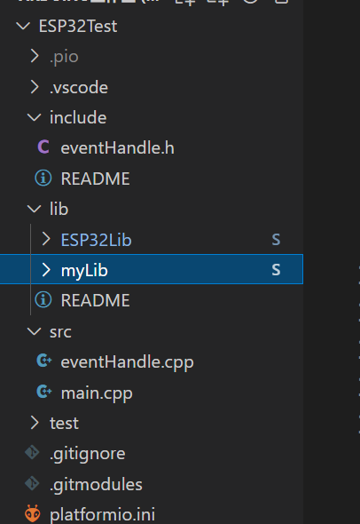
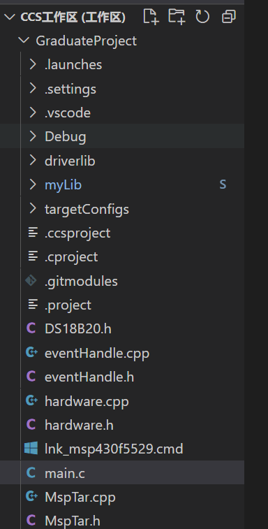
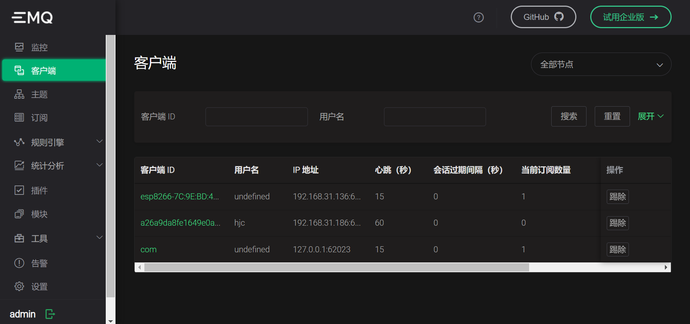

# 2022年4月11日- 2022年4月17日

## 学习内容和已完成设计（论文）内容

### 学习使用 git

1. 随着项目变大，将项目放在本地磁盘，只有一份备份变得更不安全，硬盘损坏造成的损失更大。
2. MSP430和ESP32虽然是基于两种环境开发的，但都是使用C++，有一些自己的库是共同的，当更改这些库的内容时非常麻烦，需要更改两个副本，而且保持两个副本时间久了难免产生差异，使得维护难度加大。
3. 添加新功能或修改后导致问题，需要恢复成上一个版本，使用文件系统利用拷贝文件夹的方式进行备份非常不方便，而且经常忘记备份

使用 git 的子模块将MSP430和ESP32用到的相同部分同步





myLib 子模块就是两者的相同部分

### 优化程序结构

1. 将MSP430与ESP32通信程序中的帧打包函数中的多层if else 嵌套改成使用标志位表示工作阶段和 switch case 结构，同时将一些逻辑包装为函数，使得打包函数变得结构清晰，比原来容易维护。

```cpp
void Tar::AnalysisReadList(uint8_t data)
{
    m_newData = data;
    DetectFrameHeader();
    switch (m_flag)
    {
    case 0: //等待帧头的到来
    {
        break;
    }
    case 1: //已经接收到帧头，此时应该重启帧
    {
        m_readBuff.clear();
        m_flag++;
        break;
    }
    case 2: //接收帧长度
    {
        GetFrameLength();
        m_flag++;
        break;
    }
    case 3: //接收数据
    {
        GetData();
        break;
    }
    }
    m_oldData = m_newData;
}
```

2. 此外还用相同的方式优化了从 tcp 字节流中区分出帧的程序，并封装为类，使用了事件驱动的方式，提高了代码复用率，实现了 “高内聚低耦合” 的风格。
3. 通过使用 C# 的 get 和 set ，将部分功能由事件驱动转为数据驱动，进一步提高了封装性，减小了耦合性。

### 准备中期检查

整理材料，制作 ppt ，准备中期检查。

## 本次工作中的收获

1. 分阶段的，有工作流程的程序使用 switch case 会比使用 if else 结构清晰，代码更易读
2. 使用 git 管理项目，提高了代码复用率，提高了项目的易维护性
3. 通过准备中期检查，见识到了厉害的同学，明白了需要更加刻苦学习
4. 通过中期检查整理了材料，对工作进行了总结，有利于毕业论文的撰写和后续工作的展开

## 与上周工作和原定进度安排相比，未完成的工作和原因

1. 未继续完善网页的软件。原因：项目混乱，急需优化，临时学习了 git 和优化了一些代码，防止后期项目无法维护。同时临时接到通知要准备中期检查，时间仓促。

## 设计困难和解决方案，下周工作进度安排

1. 学习 MQTT 协议和 ASP.NET Core 平台，将现有的项目从 .NET Framework 移植到 ASP.NET Core 上
1. 将 ESP32 与服务器通信的程序改为基于 MQTT 的
1. 网页使用 MQTT.js ，使用基于 WebSocket 的 MQTT，订阅 MQTT 主题，直接用 js 获取到数据后原地处理

# 2022年4月18日- 2022年4月24日

## 学习内容和已完成设计（论文）内容

### 1. 安装并配置了 emqx

下图为 emqx 的控制台



### 2. 学习了 emqx 的  HTTP 认证

emqx 可以对 MQTT 客户端的连接请求、发布请求、订阅请求分别决定是否允许。具体的流程为：当 emqx 收到 MQTT 客户端的请求后就会对配置文件中的两个 URL 进行 HTTP 的 POST 方式的请求，如果收到的 HTTP 相应的状态码为 200 则通过认证，反之则不通过。这两个 URL 分别如代码2.1和代码2.2所示

<center>代码2.1：订阅、发布主题认证 URL</center>

```python
auth.http.acl_req.url = http://127.0.0.1:80/mqtt/acl
```

<center>代码2.2：连接认证 URL</center>

```python
auth.http.auth_req.url = http://127.0.0.1:80/mqtt/auth
```

连接认证的 POST 请求的请求体如代码2.3所示：

<center>代码2.3：连接认证请求体</center>

```python
## Available Variables:
##  - %u: username
##  - %c: clientid
##  - %a: ipaddress
##  - %r: protocol
##  - %P: password
##  - %p: sockport of server accepted
##  - %C: common name of client TLS cert
##  - %d: subject of client TLS cert
##
## Value: <K1>=<V1>,<K2>=<V2>,...
auth.http.auth_req.params = clientid=%c,username=%u,password=%P
```

请求体的内容可以定制。格式可设置为 JSON 

同理，订阅、发布主题的 POST 请求体内容如代码2.4所示

<center>代码2.4：订阅、发布主题认证的 POST 请求体</center>

```python
## Available Variables:
##  - %A: access (1 - subscribe, 2 - publish)
##  - %u: username
##  - %c: clientid
##  - %a: ipaddress
##  - %r: protocol
##  - %P: password
##  - %p: sockport of server accepted
##  - %C: common name of client TLS cert
##  - %d: subject of client TLS cert
##  - %t: topic
##
## Value: <K1>=<V1>,<K2>=<V2>,...
auth.http.acl_req.params = access=%A,username=%u,clientid=%c,ipaddr=%a,topic=%t,mountpoint=%m
```

### 3. 编写程序进行 HTTP 认证测试

在 ASP.NET Core 平台上，使用 Kestrel 服务器，使用反向代理来处理请求。配置路由中间件，监听环回口的80端口，路由表添加两个认证 URL 的路径来相应 emqx 的 HTTP 认证请求。如代码3.1所示

<center>代码3.1：使用路由中间件处理 HTTP 认证请求</center>

```c#
app.MapPost("/mqtt/auth", async (HttpContext context) =>
 {
     //MQTT客户端连接认证
     int length = 0;
     if (context.Request.ContentLength != null)
     {
         length = (int)context.Request.ContentLength;
     }
     byte[] body = new byte[length];
     await context.Request.Body.ReadAsync(body, 0, body.Length);
     string str = Encoding.UTF8.GetString(body);
     Console.WriteLine(str);
     context.Response.StatusCode = 200;
 });
app.MapPost("/mqtt/acl", (HttpContext context) =>
{
    //MQTT客户端 Pub 和 Sub 认证
    context.Response.StatusCode = 200;//不做过多认证，始终允许
});


```

这里没有做验证，始终返回状态码200

### 4. 使用 MQTTNet 库类在 ASP.NET Core 上实现 MQTT 客户端

使用 MQTTNet 库用 C# 在 ASP.NET Core 平台上实现了 MQTT 客户端，订阅主题，将收到的内容输出到控制台

### 5. 使用 PubSubClient 库在 ESP32 上实现 MQTT 客户端

使用 C++ 库 PubSubClient 用 ESP32 订阅并发布主题，进行了通信测试，将收到的内容打印到串口，对 MQTTNet 实现的客户端订阅的主题发布信息，使控制台上出现内容。

## 本次工作中的收获

1. 更熟练地使用 git
2. 初步了解并测试了 MQTT 协议
3. 初步了解了 ASP.NET Core 的反向代理

## 与上周工作和原定进度安排相比，未完成的工作和原因

上周工作未完成。原因：ASP.NET Core 和 MQTT 的学习难度比想象中的大。项目的结构变动较大，更改需要时间。

## 设计困难和解决方案，下周工作进度安排

1. 继续学习 ASP.NET Core 和 MQTT 协议
2. 学习 MQTT.js
3. 将 ESP32 的与服务器通信改为基于 MQTT 
4. 设计出系统基于 MQTT 通信的流程
